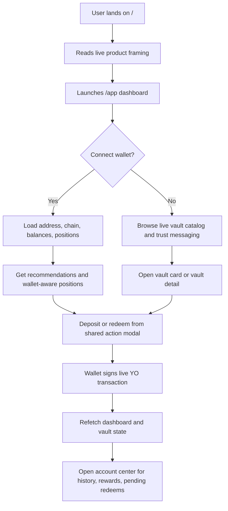
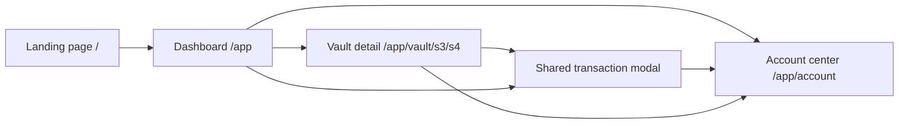
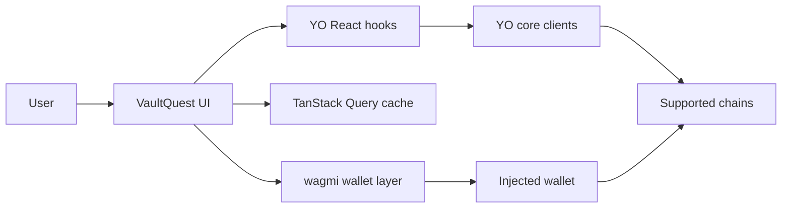
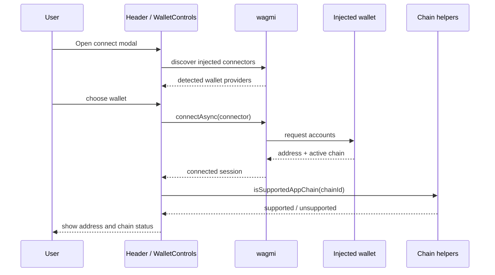
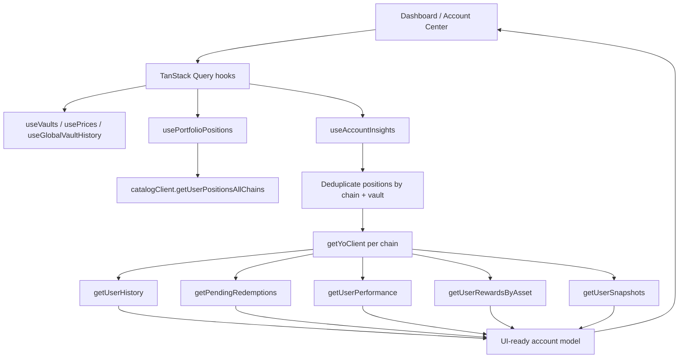
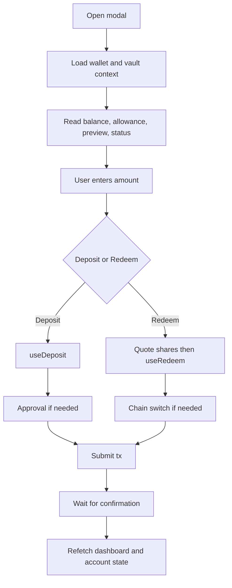
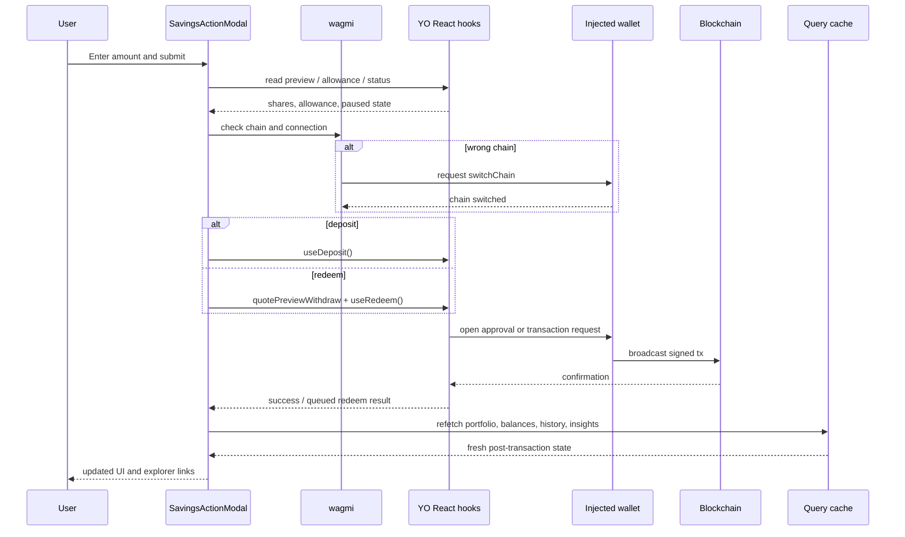

# VaultQuest

Trust-first DeFi savings built on live YO vaults.

VaultQuest is a frontend-only Next.js product that turns YO Protocol vault access into something that feels closer to a modern savings workspace than a protocol dashboard. Instead of forcing users to piece together chain context, vault state, wallet balances, approvals, and risk notes across multiple pages, VaultQuest keeps the critical facts in one place and makes every live action explicit.

The product is built around a simple idea: if a user is about to send real funds into a live onchain vault, the interface should make that action feel informed, not hidden behind generic DeFi UI patterns.

## What We Built

VaultQuest is not a mock explorer and it is not a static pitch deck. It is a working product with:

- a branded landing page that explains the product posture and shows live YO-backed stats
- a wallet-aware dashboard for browsing live YO vault venues
- supported-chain handling for Base, Ethereum, and Arbitrum
- a shared transaction modal for real deposits and redeems
- a dedicated vault detail route with deeper trust and performance context
- an account center for positions, rewards, snapshots, pending redeems, and activity
- portfolio summaries, recommendation logic, compare mode, and recent protocol activity

In practical terms, VaultQuest is a savings-oriented wrapper around the YO SDK. It makes live vault interactions easier to understand without pretending the underlying risk or chain complexity does not exist.

## Product Thesis

Most DeFi saving and yield products still assume that users will mentally assemble the following on their own:

- which chain the action will execute on
- whether their wallet is connected to the right network
- what asset is being deposited or redeemed
- whether approval is required
- how much they already hold in the vault
- what the likely output is
- whether the redeem is instant or queued
- where to inspect the final transaction

VaultQuest compresses that complexity into a tighter product story:

1. detect the wallet clearly
2. expose live vault opportunities
3. keep chain and risk context visible
4. execute the live action with explicit transaction stages
5. show the resulting account state in the same product

That is the core of the app.

## The Experience We Designed

### 1. Landing Page

The `/` route is the product framing layer. It is not only marketing copy. It already uses live YO-backed reads to show:

- supported chain count
- live vault venue count
- current protocol TVL snapshot
- recent protocol activity count
- top vault previews from the live catalog

The landing page establishes the trust model before a wallet is even connected:

- live integration, not static mock data
- visible warnings, not hidden disclaimers
- a short path from explanation to action

### 2. Dashboard

The `/app` route is the core product surface.

This page combines three kinds of information at once:

- market context: vault catalog, yields, TVL, protocol activity
- wallet context: connected address, balances, positions, supported chain state
- action context: deposit, redeem, compare, recommendations, risk messaging

The dashboard is intentionally structured to answer the questions a user typically has before interacting with a vault:

- What live vaults are available?
- Which chain am I on?
- What do I already hold?
- Which vault fits the assets already in my wallet?
- Can I compare two routes quickly?
- If I click deposit or redeem, what exactly happens next?

### 3. Vault Detail

The `/app/vault/[chainId]/[vaultId]` route is the confidence-building screen.

It expands one vault into a full context page with:

- vault-level metrics
- yield history
- TVL history
- share price history
- allocation snapshots
- percentile and benchmark context from YO
- vault transaction history
- wallet-specific position and pending redeem data

The point of this page is not navigation depth for its own sake. It exists so the user can move from discovery to conviction before submitting a live action.

### 4. Account Center

The `/app/account` route is the post-action surface.

This route answers the questions that appear after a user has already interacted:

- What do I own right now?
- What is still pending?
- What rewards are available?
- How has this position performed?
- What does my history across YO look like?
- Do my snapshots show a trend over time?

This keeps VaultQuest from being a single-action demo. It behaves more like an actual savings product lifecycle.

## User Interaction Flow



### Wallet Detection And Connection

VaultQuest uses an injected-wallet-first model through `wagmi`.

The connection flow is more intentional than a generic "connect" button:

1. The user opens the wallet modal from the header.
2. The app scans available injected connectors for up to 4 seconds.
3. Only wallets actually detected in the browser session are shown.
4. If named injected wallets are available, the generic injected connector is hidden to avoid duplicate-looking options.
5. After connection, the header shows the current chain label and truncated address.
6. The user can copy the address or disconnect directly from the header.

This matters because wallet connection is the first trust checkpoint in the product.

### Vault Discovery Flow

On the dashboard, the user can:

- switch between supported chains
- filter the catalog by chain
- search by vault name, asset, chain, or route
- compare up to two venues side by side
- inspect current positions per vault
- open the detail page
- launch a deposit or redeem modal directly from the vault card

Each vault card exposes:

- chain
- route type (`primary` or `secondary`)
- 30d and 7d yield
- TVL
- share price
- vault cap
- reward boost if available
- the user’s current assets and shares for that vault

That means the discovery layer is already personalized when a wallet is connected.

### Recommendation Flow

The recommendation panel is a wallet-aware helper, not a static featured list.

It works like this:

1. read the connected wallet balances from YO
2. keep only supported ERC-20 assets
3. match those assets to live vault venues on the same chain
4. rank matches by wallet balance value, then by vault yield
5. present the top recommendations as the "cleanest next deposit"

This is a subtle but important design choice: instead of recommending arbitrary high-yield vaults, VaultQuest recommends routes the user can fund immediately with assets they already hold.

### Deposit Flow

The deposit flow is handled by a shared modal used from both the dashboard and the vault detail page.

### What the user sees

Before submission, the modal shows:

- vault name
- route
- asset
- wallet address
- editable amount input
- max balance shortcut
- wallet balance on the target chain
- estimated shares received
- current chain and target chain
- whether a network switch is needed
- current allowance
- default slippage
- vault execution status
- idle balance if YO returns it
- risk reminders

### What the app does

When the user submits a deposit:

1. validate wallet connection
2. validate amount format and amount > 0
3. validate the vault is not paused
4. validate the wallet has enough token balance
5. call YO deposit execution through `useDeposit`
6. surface transaction state as it changes:
   - switching chain
   - approving
   - depositing
   - waiting for confirmation
   - success
7. show explorer links for the approval tx and deposit tx when available
8. refetch portfolio, balances, activity, and account insights on completion

The product never pretends a deposit is local state. It is clearly presented as a live onchain action.

### Redeem Flow

The redeem flow uses the same modal shell, but the logic changes to reflect how withdraws behave.

### What the user sees

The modal includes:

- redeemable asset balance
- share balance held
- quote preview for shares to burn
- network mismatch handling
- allowance information for shares
- vault status
- a reminder that some redeems may queue instead of settling instantly

### What the app does

When the user submits a redeem:

1. validate wallet connection
2. validate amount format and amount > 0
3. validate the amount does not exceed redeemable assets
4. if the wallet is on the wrong chain, switch first
5. quote the required share amount with YO
6. execute redeem through `useRedeem`
7. report progress through explicit step text
8. if YO reports a queued redemption, show the recorded request id
9. refetch vault and account data so the UI reflects the new state

This is one of the most important trust decisions in the app: the README, the UI, and the actual logic all acknowledge that redeem behavior can differ by liquidity and protocol state.

### After The Transaction

VaultQuest treats post-transaction visibility as part of the product, not as an afterthought.

After a successful deposit or redeem, the user can immediately move into:

- dashboard portfolio summary
- pending redeem panel
- account activity history
- rewards panel
- account snapshots
- vault detail metrics

That creates a complete loop from discovery to execution to monitoring.

## Information Architecture

The app is organized into four primary routes:

| Route | Purpose |
| --- | --- |
| `/` | Product framing, live proof points, and entry into the dashboard |
| `/app` | Primary savings workspace for discovery, comparison, and execution |
| `/app/vault/[chainId]/[vaultId]` | Detailed single-vault trust and analytics page |
| `/app/account` | Wallet-centric account and lifecycle management page |

This is intentionally compact. The app does not sprawl into many shallow routes. Most of the product value sits in a few dense surfaces.



## Technical Architecture

### High-Level Architecture

VaultQuest is a client-heavy Next.js App Router application with no custom backend.

That means:

- UI rendering is handled by Next.js and React
- wallet state is handled by `wagmi`
- server-state and caching are handled by TanStack Query
- live vault reads and transaction hooks come from the YO SDK
- all signing happens through the user’s injected wallet
- chain-specific reads are made from YO clients in the frontend

In simple terms, the browser is doing the orchestration.



### Provider Stack

The entire app is wrapped by three providers in `AppProviders`:

1. `WagmiProvider`
2. `QueryClientProvider`
3. `YieldProvider`

This stack is important because each layer has a distinct job:

- `WagmiProvider` manages wallet connection, chain state, and wallet actions
- `QueryClientProvider` caches live reads and controls refetch behavior
- `YieldProvider` gives the YO hooks shared execution config, including a default slippage of `50` bps

The Query Client is configured to:

- disable refetch-on-window-focus
- retry once by default

That keeps the experience stable during demos and during wallet interaction.

### Wallet And Chain Layer

The wallet configuration lives in [`lib/wallet/config.ts`](/home/okey/Desktop/Projects/vaultquest-yo/lib/wallet/config.ts).

Key decisions in this layer:

- server-side rendering is disabled for wallet config (`ssr: false`)
- the app uses the `injected` connector
- `multiInjectedProviderDiscovery` is enabled for better EIP-6963 support
- `shimDisconnect` is enabled
- async injection waits briefly for browser wallets to appear
- transports are configured for Ethereum, Base, and Arbitrum

The supported app chains are defined in [`lib/chains.ts`](/home/okey/Desktop/Projects/vaultquest-yo/lib/chains.ts), along with:

- chain labels
- short labels
- explanatory blurbs
- explorer URL helpers
- supported-chain guards

The product uses these chain helpers in both UX and logic:

- buttons for switching chains
- unsupported-chain warnings
- explorer links
- chain labels in headers, cards, and account panels



### YO Data Layer

The data layer has two levels:

### 1. Official YO React Hooks

Used directly for:

- vault catalog
- prices
- protocol TVL
- global vault history
- wallet balances
- Merkl rewards
- allowances
- deposit execution
- redeem execution
- vault detail analytics

### 2. Custom Query Hooks

Defined in [`hooks/use-yo-data.ts`](/home/okey/Desktop/Projects/vaultquest-yo/hooks/use-yo-data.ts) to compose higher-level product data:

- `usePortfolioPositions`
- `useAccountInsights`
- `useChainTokenBalance`
- `useWithdrawQuote`
- `useVaultExecutionStatus`
- `useProtocolTvlHistory`

These custom hooks are where the product starts to become more than a thin SDK wrapper.

For example, `useAccountInsights`:

- deduplicates vault positions across chains
- creates the correct YO client per chain
- fetches history, pending redeems, performance, rewards, and snapshots in parallel
- normalizes the responses into a UI-ready account model

That hook is the main reason the account center can feel like one coherent product surface instead of several unrelated API panels.



### Domain Modeling

YO vaults can expose primary and secondary venues. VaultQuest converts them into one flat list of product-ready venues in [`lib/yo/types.ts`](/home/okey/Desktop/Projects/vaultquest-yo/lib/yo/types.ts).

That flattening step standardizes:

- vault id
- chain
- asset metadata
- share asset metadata
- contracts
- yield
- TVL
- cap
- share price
- route type

This is a small but important architectural decision. It lets the UI reason about a "vault venue" consistently, regardless of whether it came from a primary or secondary YO route.

### Read Versus Execution Clients

The app creates YO clients for all supported chains in [`lib/yo/clients.ts`](/home/okey/Desktop/Projects/vaultquest-yo/lib/yo/clients.ts).

- chain-specific clients are used for chain-aware reads and quotes
- a shared catalog client is anchored to Base for general catalog reads

This is why the app can support:

- global vault discovery
- per-chain token balance checks
- per-chain quote previews
- chain-specific pending redeem and performance reads

without introducing a backend service.

### Transaction Architecture

The transaction rail is centered on [`components/savings/action-modal.tsx`](/home/okey/Desktop/Projects/vaultquest-yo/components/savings/action-modal.tsx).

This component is shared by:

- the dashboard
- the vault detail route

That reuse matters because it keeps deposit and redeem behavior consistent across the app.

At the implementation level, the modal combines:

- wallet connection state from `wagmi`
- YO execution hooks for deposit and redeem
- YO read hooks for previews, allowance, balance, and vault execution status
- local validation and UI state for input, step labels, and errors



The result is a transaction UX that explains itself while the user is in it.



### State Refresh Strategy

A product like this only feels correct if the UI refreshes after live execution.

VaultQuest explicitly refetches the relevant reads after successful actions.

Examples:

- the dashboard refreshes portfolio, balances, activity, and account insights
- the vault detail page refreshes vault state, history, allocations, percentiles, user performance, allowances, and pending redeems

This keeps the product aligned with live chain state immediately after the wallet confirms a transaction.

### UI System And Visual Language

The visual system is defined in [`app/globals.css`](/home/okey/Desktop/Projects/vaultquest-yo/app/globals.css).

The app uses:

- a dark green-to-black atmospheric background
- radial highlights for depth
- a subtle grid mask overlay
- glass-style panels
- Space Grotesk for display typography
- Manrope for body text
- mint as the primary positive/action color
- warm and danger accents for caution and failure states

The styling direction supports the product idea:

- calm, but not sterile
- premium, but still readable
- dense enough for a real dashboard
- clear enough for a demo and first-time users

### Component Architecture

The component tree is intentionally grouped by domain, not by generic UI patterns alone.

### Layout Components

[`components/layout/`](/home/okey/Desktop/Projects/vaultquest-yo/components/layout)

- global providers
- logo
- header
- footer

### Savings Components

[`components/savings/`](/home/okey/Desktop/Projects/vaultquest-yo/components/savings)

- main dashboard
- transaction modal
- account center panels
- vault detail client
- recommendation panel
- risk panel
- landing-page vault preview strip

### Wallet Components

[`components/wallet/`](/home/okey/Desktop/Projects/vaultquest-yo/components/wallet)

- wallet connection and account controls

### UI Primitives

[`components/ui/`](/home/okey/Desktop/Projects/vaultquest-yo/components/ui)

- button
- modal

This separation is useful because the product logic mostly lives at the domain-component layer, while the lower UI primitives stay minimal.

## Project Structure

```text
app/
  layout.tsx                         Root layout, fonts, metadata, providers
  globals.css                        Global visual system and utility classes
  page.tsx                           Landing page
  app/page.tsx                       Main dashboard
  app/account/page.tsx               Account center route
  app/vault/[chainId]/[vaultId]/     Vault detail route

components/
  home/                              Landing-page live panels
  layout/                            Header, footer, logo, providers
  savings/                           Dashboard, detail page, account center, modal
  ui/                                Button and modal primitives
  wallet/                            Wallet connect and account controls

hooks/
  use-hydrated.ts                    Client hydration guard
  use-yo-data.ts                     Aggregated YO query hooks

lib/
  chains.ts                          Supported networks and explorer helpers
  env.ts                             Public RPC environment access
  utils.ts                           Formatting and UI helpers
  wallet/config.ts                   wagmi configuration
  yo/clients.ts                      Read-only YO clients per supported chain
  yo/types.ts                        Vault venue flattening and route helpers
```

## Tech Stack

- Next.js `16.1.6`
- React `19.2.4`
- Bun `1.3.9`
- Tailwind CSS `3.4.17`
- wagmi `3.5.0`
- viem `2.47.0`
- TanStack Query `5.90.21`
- `@yo-protocol/core` `1.0.5`
- `@yo-protocol/react` `1.0.5`

## Supported Chains

VaultQuest explicitly supports:

- Base
- Ethereum
- Arbitrum

Important nuance:

- the wallet and chain-handling layer supports all three
- the live YO catalog surfaced to the app is currently more Base/Ethereum oriented
- when Arbitrum has no currently surfaced live venues, the UI says so directly instead of failing silently

That is a good example of the product philosophy: unsupported or empty states should be explicit.

## Environment Variables

Create `.env.local` and provide RPC overrides if you do not want to rely on default endpoints.

```bash
NEXT_PUBLIC_BASE_RPC_URL=
NEXT_PUBLIC_ETHEREUM_RPC_URL=
NEXT_PUBLIC_ARBITRUM_RPC_URL=
```

The example values are documented in [`.env.example`](/home/okey/Desktop/Projects/vaultquest-yo/.env.example).

## Local Setup

### Prerequisites

- Bun `1.3.9` or newer
- Node.js `24+`
- a browser wallet such as MetaMask, Rabby, or Coinbase Wallet extension

### Install

```bash
bun install
```

### Development

```bash
bun run dev
```

### Typecheck

```bash
bun run typecheck
```

### Lint

```bash
bun run lint
```

### Production Build

```bash
bun run build
```

### Start Production Server

```bash
bun run start
```

## Demo Narrative

If you want to walk somebody through the product in the same order it was designed:

1. Start on `/` and frame VaultQuest as a trust-first savings product on top of YO.
2. Show that the landing page already uses live protocol reads.
3. Move to `/app`.
4. Connect a browser wallet from the header.
5. Use the chain filter and search to narrow the catalog.
6. Open a vault card and point out route, chain, yield, and current position.
7. Use compare mode on two vaults.
8. Open the deposit modal and show previews, allowance, target chain, and trust notes.
9. Open a vault detail page to show analytics, benchmark context, and your route on that vault.
10. Open the account center to show the full lifecycle: positions, history, pending redeems, rewards, and snapshots.

That sequence tells the full story of what VaultQuest is trying to be.

## Why The Architecture Fits The Product

The architecture is simple on purpose.

There is no custom backend because the real value of the product is in orchestration and clarity:

- combining wallet state with live vault reads
- flattening protocol data into product-ready venues
- converting several raw YO responses into a coherent account layer
- making transaction states visible
- refreshing state immediately after execution

In other words, VaultQuest is not trying to replace the protocol. It is trying to make protocol power understandable.

## Current Constraints And Honest Notes

- VaultQuest is a frontend for live onchain interactions, not a paper-trading environment.
- Users still approve and sign every action in their wallet.
- Gas fees are external to the app.
- Yield is variable and not guaranteed.
- Smart contract risk remains.
- Some redeems may queue depending on protocol liquidity conditions.
- Arbitrum is supported at the wallet layer even when the current live catalog does not expose many routes there.

Those constraints are not side notes. They are part of the product design.

## Summary

VaultQuest is a compact but complete YO-powered savings product.

It gives users:

- a live vault discovery layer
- wallet-aware recommendations
- chain-aware execution
- explicit deposit and redeem feedback
- trust context before signing
- post-transaction visibility after execution

And it does that with a frontend architecture that stays close to the protocol while still feeling like a designed consumer product.
